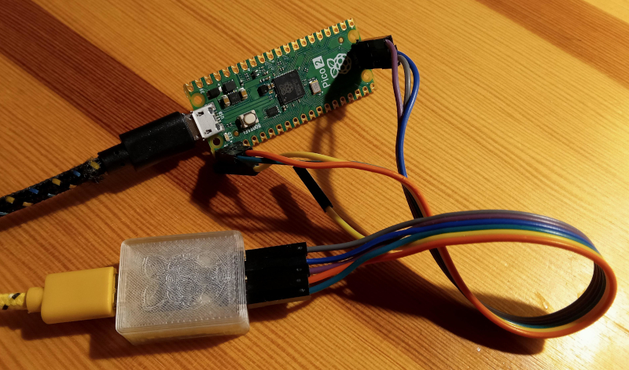
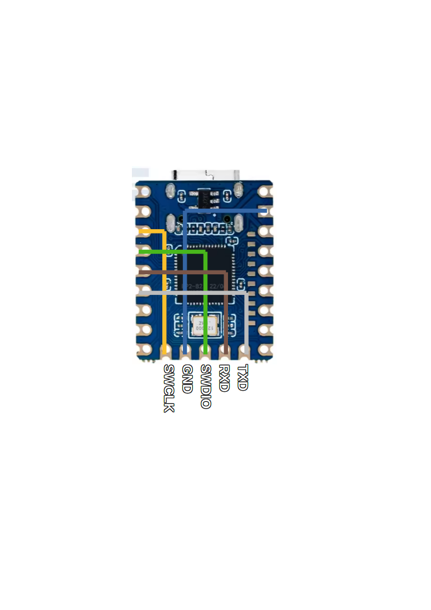
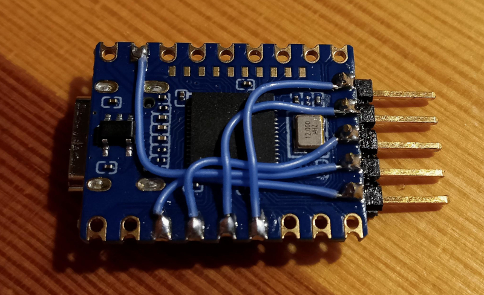

# RP2040 zero based miniature pico debug probe

In this repo I'll describe how to build miniature pico debug probe using Waveshare RP2040 zero board.

When it's done it should look like this:

## Wiring

All you need is RP2040 zero board, few wires and angeled 5p pin row. Pin row is soldered into lower 5 pins of zero, GPIO9 - GPIO13. Those pins are not used in probe, left floating. It's only used for the mechanics.

### Wiring table

pin | bottom pin (mechanical) | signal
--- | --- | ---
GP02 | GP09 | SWCLK
GND | GP10 | GND
GP03 | GP11 | SWDIO
GP04 | GP12 | Target RXD
GP05 | GP13 | Target TXD

## Firmware

The firmware is standard pico degub probe firmware for raspberry pi pico (not for debug probe HW it self). You can find it [here](https://github.com/raspberrypi/debugprobe/releases/download/debugprobe-v2.2.3/debugprobe_on_pico.uf2).
Flash it by pressing both buttons on board, releasing reset and later releasing boot. This way board goes into boot mode, acting as an mass storage flash device. Drop firmware u2f file there and youre done.
Maybe, in future, I'll modify it to use onboard RGB led .. see ToDo.

## Enclosure

The enclosure consists of two parts and is printed in basic PLA. You can chose the one with logo on top and text on bottom, or the one without. I've printed both, but text is a bit blury, even if it's printed with 0.1 layer (but still 0.4 nozzle). You can also try 2 colour print, maybe it'll be better.

## ToDo

- [ ] use onboard led to indicate status or at least to make logo shining
